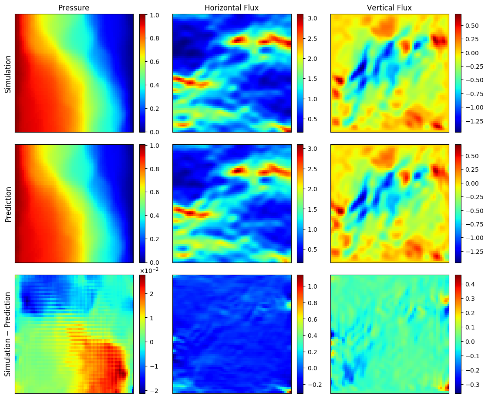
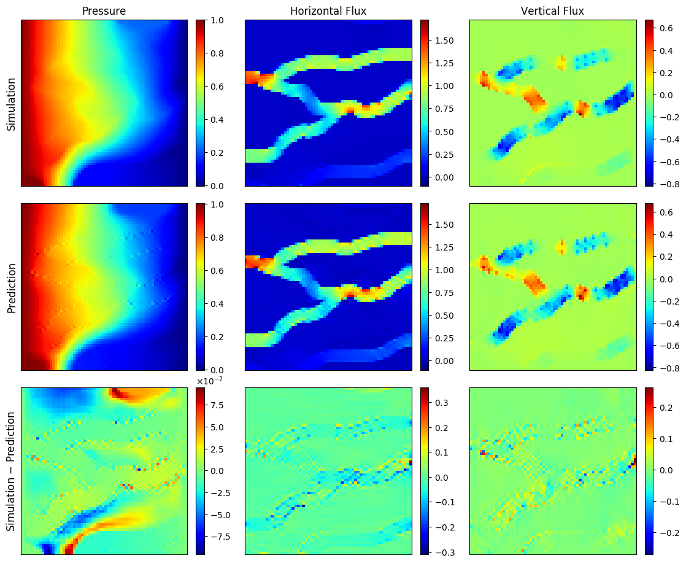
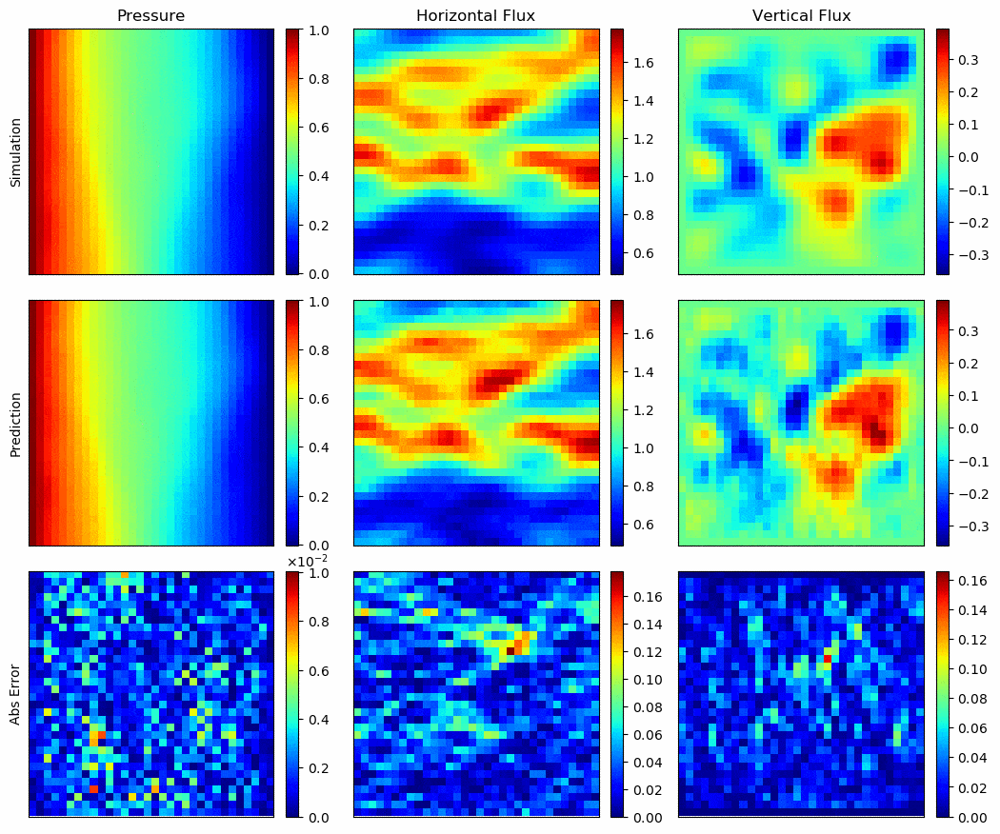
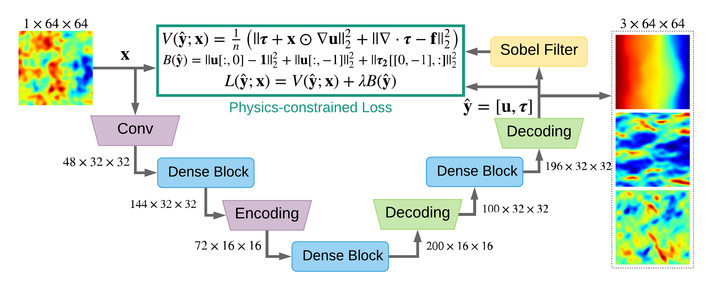
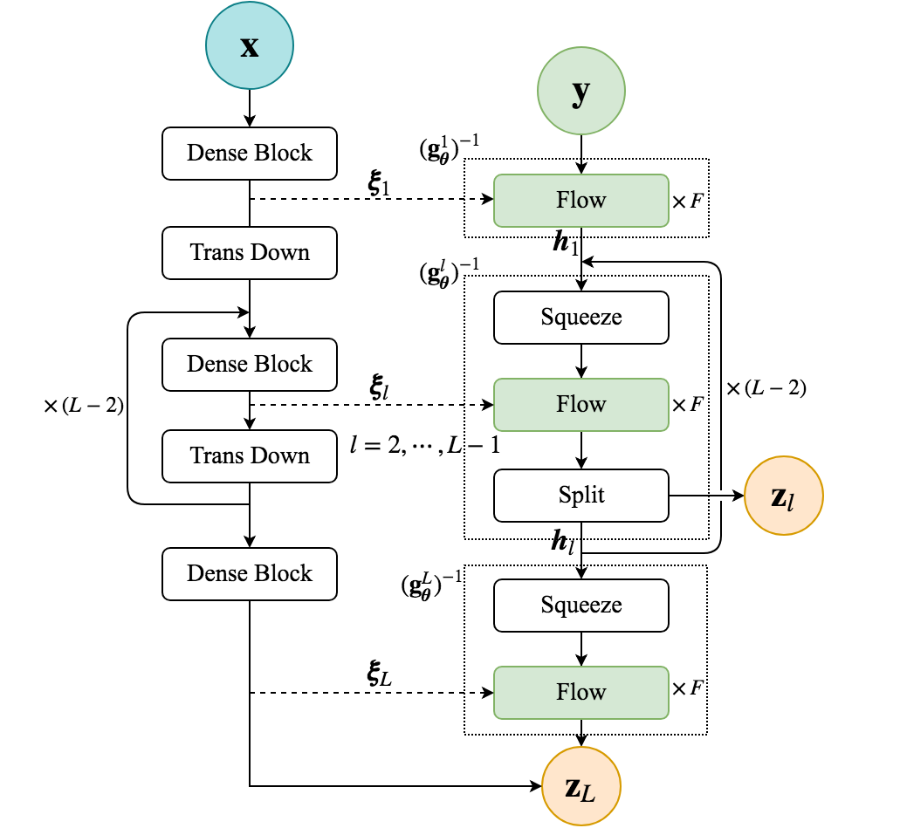
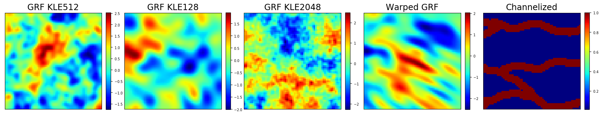

# Physics-Constrained Surrogates without Labeled Data
PyTorch implementation for [Physics-constrained deep learning for high-dimensional surrogate modeling and uncertainty quantification without labeled data](https://arxiv.org/abs/1901.06314). This is accomplished by appropriately incorporating the governing equations into the loss / likelihood functions, as demonstrated with both deterministic surrogates (convolutional encoder-decoder networks) and probabilistic surrogates (flow-based conditional generative models).

[Yinhao Zhu](https://scholar.google.com/citations?user=SZmaVZMAAAAJ&hl=en), [Nicholas Zabaras](https://engineering.nd.edu/profiles/nzabaras), [Phaedon-Stelios Koutsourelakis](https://www.professoren.tum.de/en/koutsourelakis-phaedon-stelios/), [Paris Perdikaris](https://www.seas.upenn.edu/directory/profile.php?ID=237)

Codec - GRF KLE512 | Codec - Channelized | cGlow - GRF KLE100 
:-----:|:------:|:-----:
 |    |   

<p align="center">
  
  
</p>

Install dependencies in [requirements.txt](./requirements.txt) and clone our repository
```bash
git clone https://github.com/cics-nd/pde-surrogate.git
cd pde-surrogate
```


## Dataset
Input dataset includes Gaussian random field (GRF) with different truncations of *N* leading terms of Karhunen-Loeve expansion (KLE) *GRF KLE-N*, *Warped GRF*, and *Channelized* field. Corresponding output are solved with FEniCS. Note that only input samples are needed to train the physics-constrained surrogates.

<p align="center">

</p>

Download the dataset with 64x64 grid
```bash
bash ./scripts/download_datasets.sh 64
```
Change `64` to `32` to download the dataset with 32x32 grid (mainly for probabilistic surrogate).
The dataset is saved at `./datasets/`.


## Deterministic Surrogates - Convolutional Encoder-Decoder Networks

### Physics-constrained surrogates
Train a *physics-constrained* surrogate with mixed residual loss without output data
```
python train_codec_mixed_residual.py --data grf_kle512 --ntrain 4096 --batch-size 32
```
- Use `--data channelized` to train the surrogate for channelized permeability fields.
- Choose smaller `--batch-size` when num of training data `--ntrain` is smaller, check more hyperparameters in `Parser` class.
- `--cuda n` select `n`-th GPU card
- Check [darcy.py](./models/darcy.py) for the PDE loss and boundary loss for the Darcy flow problem.
- Check [image_gradient.py](./utils/image_gradient.py) for Sobel filter to estimate spatial gradients.
- The experiments are saved at `./experiments/codec/mixed_residual/`.

### Data-driven surrogates
Train a *data-driven* surrogate with maximum likelihood, which requires output data
```
python train_codec_max_likelihood.py --data grf_kle512 --ntrain 4096 --batch-size 32
```
- You may try different `--data`, `--ntrain`, `--batch-size`, and many other hyperparameters, see `Parser` class in `train_codec_mixed_residual.py` and `train_codec_max_likelihood.py`.
- The experiments are saved at `./experiments/codec/max_likelihood/`.


## Probabilistic Surrogates - Conditional Glow

Train conditional Glow with reverse KL divergenece loss without output data
```
python train_cglow_reverse_kl.py --beta 150 --ntrain 4096 --kle 100 --imsize 32
```
Tune the network structure by setting hyperparameters, e.g.
- `--beta`: precision parameter for the reference density
- `--enc-blocks`: e.g. `[3, 4, 4]`, a list of # layers in each dense block of encoder network
- `--flow-blocks`: e.g. `[6, 6, 6]`, a list of # steps of flow in each level of the Glow model
- `--coupling`: `'dense'` or `'wide'`, the type of coupling network for affine coupling layer
- Check [glow_msc.py](./models/glow_msc.py) for the multiscale conditional Glow model
- Use `--data-init` to speed up training with one minibatch of labeled data. 
Note that this is *not necessary*.
- The experiments are saved in `./experiments/cglow/reverse_kl/`.


Try more difficult case of `KLE512` over `64x64` grid
```
python train_cglow_reverse_kl.py --beta 150 --ntrain 8192 --kle 512 --imsize 64 --lr 0.001
```
Also modify `--enc-blocks` to be `[3, 3, 3, 3]`, and `--flow-blocks` to be `[4, 4, 4, 4]`. 
You should expect much longer training time and potentially unstable training. 
When it is unstable, use additional `--resume` to resume training from the latest checkpoint saved, or `--ckpt-epoch 100` to resume from specific checkpoint, e.g. at 100 epochs. Use `--data-init` also helps.


## Solving Deterministic PDEs
Convolution Decoder Networks VS Fully-Connected Neural Networks

### To solve Darcy flow equation with ConvNet
```
python solve_conv_mixed_residual.py --data grf --kle 1024 --idx 8 --verbose
```
- `--data`: ['grf', 'channelized', 'warped_grf']
- `--kle`: [512, 128, 1024, 2048], no need to set for 'channelized' and 'warped_grf'
- `--idx`: 0-999, index for selecting which input to solve for 'grf', 'warped_grf', 0-512 for 'channelized'
- `--versbose`: add this flag to show more detailed output in terminal
- Results are saved at `./experiments/solver/`

For solving nonlinear PDEs, add `--nonlinear` flag, which will call FEniCS to solve the nonlinear Darcy flow ([fenics.py](./utils/fenics.py) as the reference for the ConvNet solution.
```
python solve_conv_mixed_residual.py --data grf --kle 1024 --idx 8 --nonlinear --alpha1 0.1 --alpha2 0.1
```
where `alpha1` and `alpha2` are the coefficients in the nonlinear constitutive equation.
Check `main()` for other hyperparameters in `solve_conv_mixed_residual.py`.

### To solve Darcy flow with fully-connected neural nets
```
python solve_fc_mixed_residual.py --data grf --kle 512 --idx 8 --verbose
```
Same hyperparameters as the ConvNet case. Nonlinear PDE case is not investigated here.


## Pretrained Models
Download the pre-trained probabilistic surrogates
```bash
bash ./scripts/download_checkpoints.sh
```
Then you can check useful post-processing functions, including the ones for uncertainty quantification.
```
python post_cglow.py
```
- Use `--run-dir` to specify the directory for your own runs, default is the downloaded pretrained model.


## Citation
If you use this code for your research, please cite our paper.
```
@article{zhu2019physics,
  title={Physics-Constrained Deep Learning for High-dimensional Surrogate Modeling and Uncertainty Quantification without Labeled Data},
  author={Yinhao Zhu and Nicholas Zabaras and Phaedon-Stelios Koutsourelakis and Paris Perdikaris},
  journal={Journal of Computational Physics},
  volume = "394",
  pages = "56 - 81",
  year={2019},
  issn={0021-9991},
  doi={https://doi.org/10.1016/j.jcp.2019.05.024}
}
```
